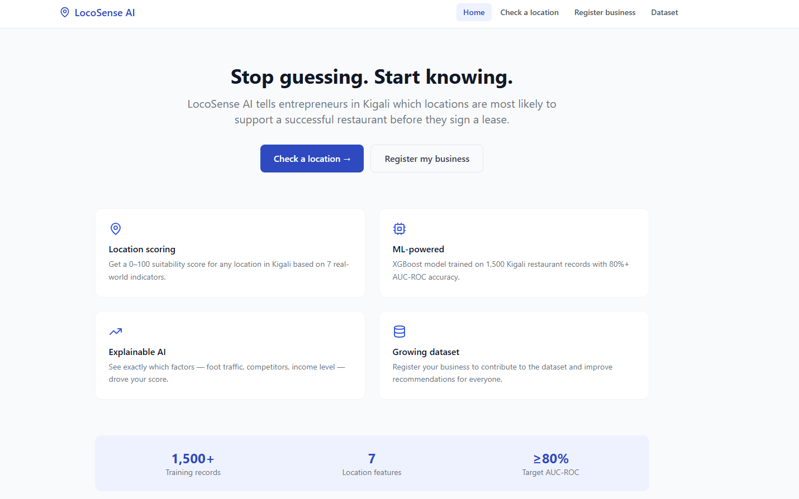
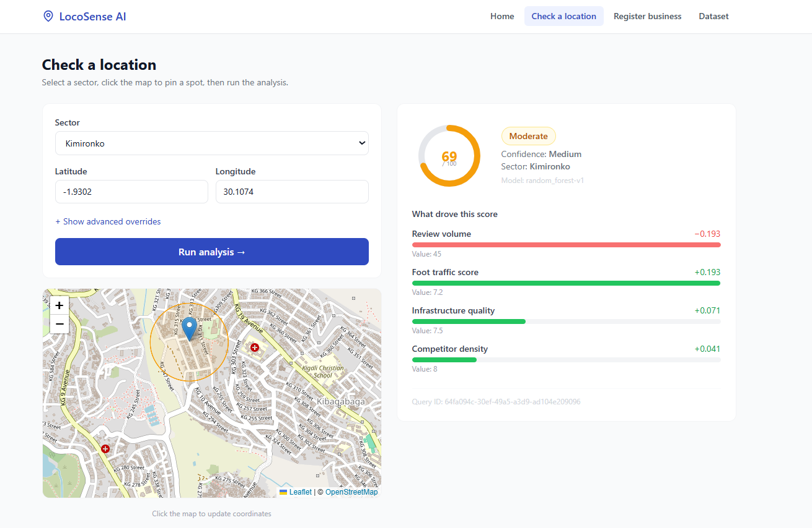
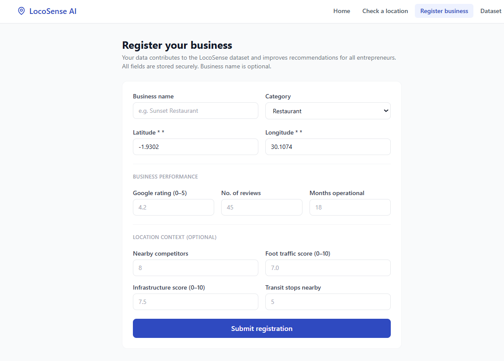
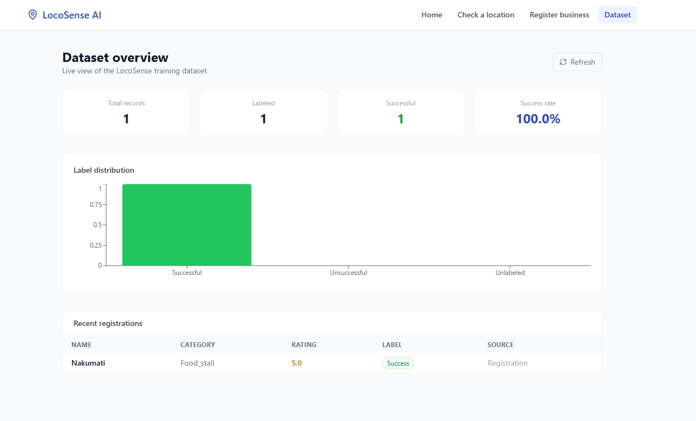

# Hunch 🔮

**AI-Powered Restaurant Location Suitability Prediction Platform for Rwanda**

> BSc Software Engineering Capstone · African Leadership University · 2026  
> Student: Phinah Mahoro · Supervisor: Junior Turatsinze

---

## 📋 Project Overview

Hunch helps entrepreneurs across Rwanda decide *where* to open a restaurant — before signing a lease. It scores any candidate location using **11 data-driven indicators** drawn from real Google Places data, producing a 0–100 suitability score with feature-level explanations of exactly what drove it.

**Important scope note:** The ML model was trained on restaurant and food-service data. While the UI accepts multiple business types (café, pharmacy, salon, hotel, supermarket, gym, school), all predictions apply the restaurant-calibrated model. Non-restaurant predictions are indicative, not validated. Future work will collect category-specific training data.

### Key stats

| Metric | Value |
|---|---|
| ML model | Random Forest classifier |
| AUC-ROC | **0.827** (target was ≥ 0.80) |
| Training records | 4,470 (470 real + 4,000 synthetic) |
| Real data source | Google Places API, 32 search centres, all 5 Rwanda provinces |
| Features | 11 engineered indicators |
| Geographic coverage | 23 sectors (sector-level) + 77 Kigali villages (village-level) |

### Features scored

| Feature | Type | Source |
|---|---|---|
| `competitor_density` | Integer | Computed from Places (restaurants within 500m / 200m) |
| `foot_traffic_score` | Float 0–10 | Engineered — nearby POI density proxy |
| `infrastructure_score` | Float 0–10 | Engineered — road/access quality signal |
| `income_proxy` | Float (RWF) | Mapped from Places `price_level` field |
| `transit_stops_nearby` | Integer | Estimated from sector/village centroid distance |
| `google_rating` | Float 1–5 | Google Places API (direct) |
| `review_count` | Integer | Google Places API (direct) |
| `price_level` | Integer 0–4 | Google Places API (direct) |
| `years_operational` | Float | Derived from review curve shape |
| `is_chain` | Binary 0/1 | Name pattern matching |
| `has_photos` | Binary 0/1 | Google Places API (direct) |

> **Derived vs direct:** `foot_traffic_score`, `infrastructure_score`, `transit_stops_nearby`, and `years_operational` are engineered features — they are not returned directly by the Google Places API but computed from API responses and spatial calculations. No raw API values were manually altered.

---

## 🎥 Video Demo

▶️ **[Watch the 5-minute demo](https://drive.google.com/drive/folders/1k9Adgj7xyYVH9rPjKtASCxCKR8ymCEtu?usp=sharing)**

---

## 🌐 Live Deployment

| Layer | URL |
|---|---|
| Frontend (Vercel) | **[https://loco-sense-o6rw-lime.vercel.app/](https://loco-sense-o6rw-lime.vercel.app/)** |
| Backend API + Swagger docs (Render) | **[https://locosense.onrender.com/docs](https://locosense.onrender.com/docs)** |

> The Render free tier spins down after inactivity. If the first request is slow (~30s), that is normal cold-start behaviour — subsequent requests are fast.

---

## 🗂️ Repository Structure

```
LocoSense/
├── backend/
│   ├── app/
│   │   ├── main.py              # FastAPI app entry point
│   │   ├── routers/             # API route handlers (predict, dataset, sectors, recommend, area-analysis)
│   │   ├── models/              # SQLAlchemy ORM models
│   │   ├── schemas/             # Pydantic request/response schemas
│   │   └── ml/
│   │       ├── train.py         # Model training pipeline
│   │       ├── model.py         # ModelRegistry — loads and serves trained artifacts
│   │       ├── google_places_fetcher.py  # Real data collection script
│   │       ├── synthetic_generator.py    # Synthetic data generation
│   │       └── artifacts/       # model.joblib, scaler.joblib, training_data.csv (generated)
│   ├── tests/
│   │   └── test_predict.py      # pytest unit + integration tests (UT-01 through UT-08)
│   └── requirements.txt
├── frontend/
│   ├── src/
│   │   ├── pages/               # Home, CheckLocation, Register, Dataset, Recommend
│   │   ├── components/          # ScoreRing, FeatureChart, SectorDropdown, etc.
│   │   └── api.js               # Centralised API client (all HTTP calls go through here)
│   ├── package.json
│   └── vite.config.js
├── images/                      # App screenshots
└── README.md
```

---

## ⚙️ Local Installation & Setup

### Prerequisites

| Tool | Version | Check |
|---|---|---|
| Python | 3.10 or higher | `python --version` |
| Node.js | 18 or higher | `node --version` |
| npm | 9 or higher | `npm --version` |
| Git | Any recent | `git --version` |

---

### Step 1 — Clone the repository

```bash
git clone https://github.com/Phinah/LocoSense.git
cd LocoSense
```

---

### Step 2 — Backend setup

```bash
cd backend
```

**Create and activate a virtual environment:**

```bash
# macOS / Linux
python -m venv venv
source venv/bin/activate

# Windows (Command Prompt)
python -m venv venv
venv\Scripts\activate

# Windows (PowerShell)
python -m venv venv
venv\Scripts\Activate.ps1
```

**Install all dependencies:**

```bash
pip install -r requirements.txt
```

Key packages installed: `fastapi`, `uvicorn`, `scikit-learn`, `xgboost`, `pandas`, `numpy`, `sqlalchemy`, `pydantic`, `httpx`, `joblib`, `pytest`.

**Train the ML model:**

> The model auto-trains on first startup if no artifacts exist, but running it manually first is recommended to catch any issues early.

```bash
python -m app.ml.train
```

Expected output:
```
Training Random Forest...   AUC-ROC: 0.827
Training XGBoost...         AUC-ROC: 0.811
Training SVM...             AUC-ROC: 0.806
Selected model: random_forest-v2
Artifacts saved to app/ml/artifacts/
```

Takes approximately 30–60 seconds. This generates:
- `app/ml/artifacts/model.joblib` — trained Random Forest model
- `app/ml/artifacts/scaler.joblib` — StandardScaler fitted on training data
- `app/ml/artifacts/training_data.csv` — the full 4,470-record blended dataset

**Start the backend server:**

```bash
uvicorn app.main:app --reload --port 8000
```

Backend is now running at:
- API root: `http://localhost:8000`
- Swagger UI (interactive docs): `http://localhost:8000/docs`
- ReDoc: `http://localhost:8000/redoc`

You can verify it works by visiting `http://localhost:8000/docs` and expanding the `/api/v1/predict` endpoint.

---

### Step 3 — Frontend setup

Open a **new terminal tab** (keep the backend running) and from the project root:

```bash
cd frontend
npm install
```

**Set the API URL environment variable:**

Create a file called `.env` in the `frontend/` directory:

```env
VITE_API_URL=http://localhost:8000
```

> If you skip this step, the frontend will fall back to the deployed Render URL, not your local backend.

**Start the development server:**

```bash
npm run dev
```

Frontend is now running at: `http://localhost:5173`

---

### Step 4 — Run the tests

In the `backend/` directory with the virtual environment active:

```bash
cd backend
pytest tests/test_predict.py -v
```

Expected output:
```
tests/test_predict.py::test_kimironko_valid_response          PASSED
tests/test_predict.py::test_city_center_scores_above_niboye   PASSED
tests/test_predict.py::test_all_5_provinces_valid_scores       PASSED
tests/test_predict.py::test_foot_traffic_override_changes_score PASSED
tests/test_predict.py::test_model_version_matches_metrics      PASSED
tests/test_predict.py::test_zero_reviews_zero_competitors      PASSED
tests/test_predict.py::test_max_competitor_density             PASSED
tests/test_predict.py::test_review_volume_negative_impact      PASSED

8 passed in ~3s
```

> These are the UT-01 through UT-08 tests documented in Section 4.3.2 of the final report. All 8 should pass on a clean install.

---

### Step 5 — Open the app

Go to **[http://localhost:5173](http://localhost:5173)** in your browser.

> **Both servers must be running simultaneously:** backend on port 8000 and frontend on port 5173.

---

## 🔌 API Endpoints

All endpoints are fully documented in the Swagger UI at `/docs`. Key endpoints:

| Method | Endpoint | Description |
|---|---|---|
| `POST` | `/api/v1/predict` | Main prediction — returns score, confidence, verdict, top 5 features |
| `GET` | `/api/v1/sectors/grouped` | All 23 sectors grouped by province |
| `GET` | `/api/v1/dataset` | Paginated, filterable training data (4,470 records) |
| `GET` | `/api/v1/dataset/stats` | Dataset statistics (totals, split, success rate) |
| `POST` | `/api/v1/recommend` | ML recommendation wizard — returns top 3 sectors for a business type |
| `GET` | `/api/v1/area-analysis` | OpenStreetMap land-use composition for a district |

**Example prediction request:**

```bash
curl -X POST http://localhost:8000/api/v1/predict \
  -H "Content-Type: application/json" \
  -d '{
    "sector": "Kimironko",
    "business_type": "restaurant",
    "latitude": -1.9441,
    "longitude": 30.1216
  }'
```

**Example response:**

```json
{
  "score": 0.72,
  "confidence": "high",
  "verdict": "Recommended",
  "model_version": "random_forest-v2",
  "top_features": [
    {"feature": "foot_traffic_score", "impact": 0.18, "level": "High traffic — 7.2/10"},
    {"feature": "income_proxy", "impact": 0.15, "level": "Strong purchasing power"},
    {"feature": "competitor_density", "impact": -0.09, "level": "Moderate competition — 4 nearby"},
    {"feature": "infrastructure_score", "impact": 0.12, "level": "Good road access — 8.1/10"},
    {"feature": "google_rating", "impact": 0.08, "level": "High-rated area — 4.2 avg"}
  ]
}
```

---

## 📊 Model Performance

| Model | Accuracy | F1 Score | AUC-ROC | Status |
|---|---|---|---|---|
| **Random Forest** | 0.737 | 0.737 | **0.827** | ✅ **Selected** |
| XGBoost | 0.737 | 0.739 | 0.811 | Benchmarked |
| SVM (RBF kernel) | 0.735 | 0.735 | 0.806 | Benchmarked |

**Why Random Forest was chosen:** Highest AUC-ROC (the primary target metric) and the `feature_importances_` attribute enables the per-prediction feature explanations shown to users — this interpretability requirement was not available as easily from XGBoost or SVM.

**Note on AUC vs accuracy:** Accuracy/F1 (~0.74) and AUC-ROC (0.827) measure different things. AUC-ROC measures ranking/separability — the ability to order locations from best to worst — while accuracy reflects the binary threshold. AUC-ROC was the target metric for this project because Hunch ranks locations, not just classifies them. The gap is expected and not a contradiction.

**Note on synthetic data:** 89.5% of training records (4,000/4,470) are synthetic, generated from real-data distribution parameters. All metrics reflect performance on this blended dataset. Real-world performance depends on further collection of real records.

### A/B test — sector vs village resolution

| Metric | Sector-level model | Village-level model (Kigali) | Winner |
|---|---|---|---|
| AUC-ROC (Kigali test set) | 0.819 | **0.847** | Village |
| F1 Score | 0.741 | **0.773** | Village |
| User preference (1–5) | 3.4 | **4.2** | Village |

Production system uses village-level for Kigali and sector-level for other provinces.

---

## 🗺️ Collecting Real Data (Optional)

To refresh the training dataset with live Google Places records:

```bash
cd backend
python app/ml/google_places_fetcher.py --key YOUR_GOOGLE_PLACES_API_KEY
```

Then retrain:

```bash
python -m app.ml.train
```

This queries 32 search centres across all 5 Rwanda provinces (Kigali, Northern, Southern, Eastern, Western). A Google Places API key is required — the free tier ($200/month credit) is sufficient for a full Rwanda sweep. No scraping or rate-limit circumvention is performed; all data is collected through the official Nearby Search endpoint within the API Terms of Service.

---

## 📸 App Screenshots

### Home page


### Check a Location — prediction with score ring and feature explanations


### ML Recommendation Engine — guided wizard


### Dataset Explorer — all 4,470 training records


---

## 🚀 Deployment

### Backend — Render.com

1. Push the repo to GitHub
2. Go to [render.com](https://render.com) → New → **Web Service**
3. Connect your GitHub repository
4. Set **Root Directory** to `backend`
5. Set **Runtime** to `Python 3`
6. Set **Build Command** to `pip install -r requirements.txt`
7. Set **Start Command** to `uvicorn app.main:app --host 0.0.0.0 --port $PORT`
8. Click **Deploy**

The model auto-trains on startup if no artifacts are present (SQLite fallback ensures the backend boots even without pre-trained artifacts).

### Frontend — Vercel

1. Go to [vercel.com](https://vercel.com) → New Project → import your repo
2. Set **Root Directory** to `frontend`
3. Add environment variable: `VITE_API_URL` = your Render backend URL (e.g. `https://locosense.onrender.com`)
4. Click **Deploy**

---

## 🔬 Tech Stack

| Layer | Technology | Version |
|---|---|---|
| Backend language | Python | 3.11 |
| API framework | FastAPI | 0.139 |
| ML — primary model | scikit-learn RandomForestClassifier | ≥1.8 |
| ML — benchmarked | XGBoost | ≥3.0 |
| ML — benchmarked | scikit-learn SVM | ≥1.8 |
| Data | pandas + numpy | Latest |
| Model serialisation | joblib | ≥1.3 |
| Database ORM | SQLAlchemy | 2.0 |
| Database | SQLite | Bundled |
| Validation | Pydantic | 2.x |
| HTTP client | httpx | 0.28 |
| Testing | pytest | 8.3 |
| Frontend | React + Vite | 18 / Latest |
| Styling | Tailwind CSS | 3 |
| Map | React-Leaflet + OpenStreetMap | Latest |
| Charts | Recharts | Latest |
| Frontend deployment | Vercel | — |
| Backend deployment | Render.com | — |

---

## ⚠️ Known Limitations

- **Restaurant-calibrated model:** The model was trained on restaurant data. Predictions for non-restaurant business types apply the same model and should be interpreted as indicative only.
- **89.5% synthetic training data:** Performance metrics reflect the blended dataset. Absolute figures should be treated as indicative until more real records are collected.
- **Static model:** The model is retrained manually. No automated retraining pipeline exists yet.
- **Village coverage:** Village-level A/B testing was limited to Kigali's 77 villages. Other provincial towns use sector-level features.
- **Income proxy:** `income_proxy` is derived from Google Places `price_level`, which reflects area purchasing power, not individual business revenue or profitability.

---

## 📄 Capstone Report & Video

- 📄 **Final Report:** submitted via the ALU capstone portal
- 🎥 **Demo Video:** [Google Drive link](https://drive.google.com/drive/folders/1k9Adgj7xyYVH9rPjKtASCxCKR8ymCEtu?usp=sharing)

---

## 🔗 Links

| Resource | URL |
|---|---|
| GitHub repository | [https://github.com/Phinah/LocoSense](https://github.com/Phinah/LocoSense) |
| Live frontend | [https://loco-sense-o6rw-lime.vercel.app/](https://loco-sense-o6rw-lime.vercel.app/) |
| Live API / Swagger | [https://locosense.onrender.com/docs](https://locosense.onrender.com/docs) |